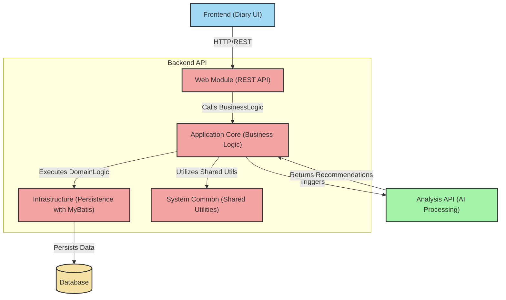

# MemoBlend


## 📖 概要

MemoBlendは日記が書けるWebアプリケーションです。
テキストはもちろん、画像や映像、音声ファイルなどで日々を記録することができます。
また、記録した内容を解析して、あなたの趣味・趣向に合わせて今後の予定を提案します。

### アプリケーションアーキテクチャ



## 🪛 ローカル環境でのアプリケーション実行手順

任意のディレクトリに本リポジトリをクローンして、バックエンドアプリケーションとフロントエンドアプリケーションをそれぞれ起動してください。

### バックエンドアプリケーション

#### 前提

- Java21がダウンロードされ、環境変数やJAVA_HOMEが設定されている。

#### 手順

1. backendフォルダーをvscodeで開いてください。
2. 以下のコマンドを実行してください。
   ``` terminal
   ./gradlew web:bootRunDev
   ```
3. [localhost:8080/api/diary](localhost:8080/api/diary)にアクセスし、日記の一覧のjsonが見れることを確認してください。

### フロントエンドアプリケーション

#### 前提

- node.jsがダウンロードされ、環境変数が設定されている。

#### 手順

1. frontendフォルダーをvscodeで開いてください。
2. 以下のコマンドを実行してください。
   ``` terminal
   npm install
   ```
3. 以下のコマンドを実行してください。
   ``` terminal
   npm run dev:diary
   ```
4. [localhost:5173](localhost:5173)にアクセスし、トップ画面が表示されていることを確認してください。

### AI アプリケーション

#### 前提

- requirements.txtから仮想環境が再現され、アクティベートされている。

#### 手順

1. analysisapiのディレクトリに移動してください。
   ```terminal
   cd analysisapi
   ```
2. 以下のコマンドを実行して、サーバーを起動します。
   ```terminal
   python -m scheduleplanner
   ```

## 📄 ライセンス
追記します。

## 🔗 関連リンク
追記します。
