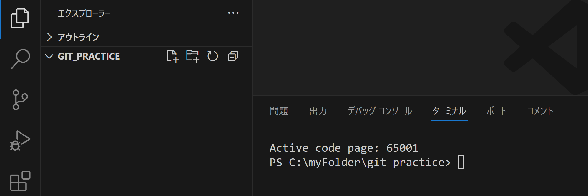

# CLIでのgitのマニュアル
本資料では、下図のような基本的なgitの流れを理解することを目的として作成している。
下図の**ローカルリポジトリ**と**リモートリポジトリ**の関係を意識して資料を読み進めていただきたい。


## 対象
本資料は、以下をすべて満たす方を対象として作成している。
- [ ] OSは、windows11を使用。MacやLinuxは未検証のため、適宜読み替えていただきたい。
- [ ] VSCodeの環境構築が済んでいる。
- [ ] gitの環境構築が済んでいる。行っていない場合は、[Gitのインストール方法(Windows版)](https://qiita.com/T-H9703EnAc/items/4fbe6593d42f9a844b1c)を参考にして設定する。
- [ ] すでにGitHub上に公開鍵をアップしており、秘密鍵を持っている状態である。
まだ行っていない場合は、[GitHubでssh接続する手順~公開鍵・秘密鍵の生成から~](https://qiita.com/shizuma/items/2b2f873a0034839e47ce) を参考にして設定する。

## ローカルリポジトリの管理下設定
本章では、GitHub上にすでに作成されているリポジトリを、新たに作成したローカルリポジトリにコピーするまでの手順を説明する。

GitHubに存在するリモートリポジトリと、ローカルPC上に存在するローカルリポジトリを連携させるためには、まずはローカルPC上の特定のフォルダをgitの管理下にする必要がある。

1. 管理下におきたいリポジトリでVSCodeを開く。本資料では、下図のリポジトリで作業を行う。

    

    また、VSCodeの起動をCLIで行いたい場合は、下記コマンドを実行する。

    ```cmd
    cd <リポジトリにしたいフォルダのパス>  # 階層の移動
    code .  # VSCodeの起動
    ```

2. 下記のコマンドで、フォルダをgitの管理下に設定する。
    ```cmd
    git init
    ```
    実行すると、下図のように".git"フォルダが作成される。この".git"フォルダがローカルリポジトリの管理人の居場所である。

    

3. 下記のコマンドで、GitHub上のMemoBlendのリポジトリ(リモートリポジトリ)をローカルリポジトリにコピーする。これを"クローン"と呼ぶ。
    ```cmd
    git clone git@github.com:ohiaeni/MemoBlend4J.git
    ```
    なお、`git@github.com:ohiaeni/MemoBlend4J.git`については、下図に示す箇所から確認できる。
    
    "Code" -> "SSH" 
    

    クローンが正常に実行できた場合、下図のように表示される。

    

## ローカルリポジトリの変更をリモートリポジトリに反映させる
ローカルリポジトリで作業を行うとファイルの変更が生じる。しかし、リモートリポジトリにはファイルの変更は自動で反映されない。本章では、その変更をリモートリポジトリに反映させるための手順を紹介する。

1. 前章の"ローカルリポジトリの管理下設定" でcloneしたMemoBlendフォルダに移動し、VSCodeで開きなおす。
    ```cmd
    cd .\MemoBlend4J\
    code .
    ```

2. ブランチの作成を行う。まず、下記のコマンドで現在作成されているブランチを確認する。
    ```cmd
    git branch
    ```
    すると、下図のように表示される。
    上記のコマンドは、ローカルリポジトリ内に作成しているすべてのブランチを表示するコマンドである。下図では、mainブランチのみが表示されている。コードの修正を行う場合は、mainブランチでは修正を行わずに、別のブランチを作成して修正を行う。

    

    下記のコマンドで、ブランチの作成を行う。
    ```
    git branch <任意のブランチ名>
    ```
    ブランチ名は任意だが、実務では命名規則が存在する。
    (参考：[Git ブランチの命名規則](https://qiita.com/Hashimoto-Noriaki/items/5d990e21351b331d2aa1))

    本資料では、下記のブランチ名とする。
    ```
    git branch feature/gitの練習
    ```

    もし、ブランチを削除したい場合は、下記コマンドを実行する。
    ```
    git branch -D feature/gitの練習
    ```

    先ほどのコマンドでブランチが作成できているか確認する。

    

    なお、色が変化しているのは、現在滞在しているブランチを表している。

3. ブランチの切り替えを行う。現在いるブランチはmainブランチだが、"feature/gitの練習"ブランチへと切り替える。
    ```
    git checkout feature/gitの練習
    ```
    >[!NOTE]
    筆者は切り替えをコマンドで行うのは面倒なので、切り替え部分はGUIでやっています。ただし、Linuxの特定のディストリビューションは、デフォルトでGUIが存在しないので、CLIで行う必要があります。
    GUIを用いたブランチの切り替え方法は別資料参照。


    下記コマンドで、現在いるブランチを確認する。
    ```
    git branch
    ```
    下図のような結果となり、切り替わっていることが確認できる。

    
    
    また、VSCodeの場合は、左下箇所でも確認できる。

    
    

4. ローカルリポジトリ内のファイルの変更を行い、リモートリポジトリに反映させる。
まずは、下図のように、git管理下のフォルダ内(ローカルリポジトリ内)で適当なファイル(例としてhello.txt)を作成する。すると、赤枠で囲った箇所が変化する。

    


5. 上記は、ローカルリポジトリのみの変更であり、リモートリポジトリには変更が反映されていない。厳密に言うと、変更したのはフォルダのみであり、ローカルリポジトリでの変更を行えていない。例えると、ローカルリポジトリを管理している管理人に変更を伝えていないようなものである。

    下記コマンドで管理人に変更内容を伝える準備を行う。
    ```
    git add .
    ```

    次に、管理人に変更内容を伝える。これを"コミット"と呼ぶ。
    ```
    git commit -m "<任意の文章>"
    ```

    文章は任意だが、例として下記内容でコミットする。
    ```
    git commit -m "hello.txtの作成"
    ```

    ここまでで、ローカルリポジトリの変更を行うことができる。しかし、リモートリポジトリには、変更をまだ伝えていない。下記コマンドでローカルリポジトリの変更内容を、リモートリポジトリの管理人に伝える。これを"プッシュ"と呼ぶ。

    ```
    git push origin <反映させたいリモートリポジトリのブランチ名>
    ```

    本資料では、例として下記ブランチにpushする。
    ```
    git push origin feature/gitの練習
    ```

    すると、リモートリポジトリにも"feature/gitの練習"ブランチが作成され、ローカルリポジトリの"feature/gitの練習"ブランチの変更内容が伝えられる。

    >[!WARNING]
    リモートリポジトリのmainブランチにはpushしないでください。
    ex. )`git push origin main` はNG。


## リモートリポジトリの変更をローカルリポジトリに反映させる
前章では、ローカルリポジトリの変更をリモートリポジトリに反映させる手順を述べた。本章では、その逆のリモートリポジトリの変更をローカルリポジトリに反映させる手順を述べる。

1. ローカルリポジトリのブランチをmainブランチに切り替える。
    ```
    git checkout main
    ```

2. ローカルリポジトリのmainブランチに、リモートリポジトリのmainブランチを反映させる。これを"プル"と呼ぶ。
    ```
    git pull origin main
    ```


## 開発の流れ
本章では今までの章を踏まえて、本資料の目的である、gitを用いた開発の大まかな流れを述べる。

### フローチャート
下図に、本資料の冒頭で紹介したフローチャートを再掲する。


### 手順
コマンドベースの開発の手順を述べる。

1. 初めてローカルリポジトリと、リモートリポジトリを連携させる場合。

    リモートリポジトリのcloneを行う。
    ```
    git clone <省略>
    ```

2. 初めてではない場合、リモートリポジトリのmainブランチの最新の状態を、ローカルリポジトリのmainブランチへと反映させる。
    ```
    git pull origin main
    ```

3. ローカルリポジトリのmainブランチから、"feature/<任意の名前>"ブランチを作成する。
    ```
    git branch feature/<任意の名前>
    ```

4. "feature/<任意の名前>"ブランチに切り替え、"feature/<任意の名前>"ブランチ内でコードの修正を行う。
    ```
    git checkout feature/<任意の名前>
    ```

5. ローカルリポジトリの変更をリモートリポジトリに反映させる。
    ```
    git push origin feature/<任意の名前>
    ```

6. GitHub内で、pushされたブランチを作成者以外のレビュアーが確認する。確認が終われば、リモートリポジトリのmainブランチに変更が反映される。これを"マージ"と呼ぶ。